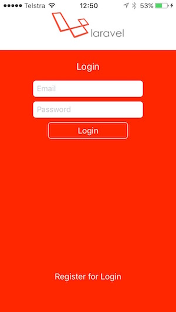

## Swift to Laravel REST Api
This is a plain, authenticated Swift3 Crud application connecting to a Laravel Rest Api on the back. It was a simple Jobs listview with a form page for deleting, adding and editing. The application is token authenticated. The token is given to the Swift application by the Laravel server after successful registration or login. 

## Pre-requisite
This application can connect to any REST API but has been developed using <a href="https://github.com/matzpersson/laravel-restapi-crud.git">Laravel-RESTAPI-Crud</a>. Follow instruction on the link to setup your REST API Server.

## Configure SWIFT app
Simple. Goto Config.swift and set your server IP Address and port.

## Screen Shots

